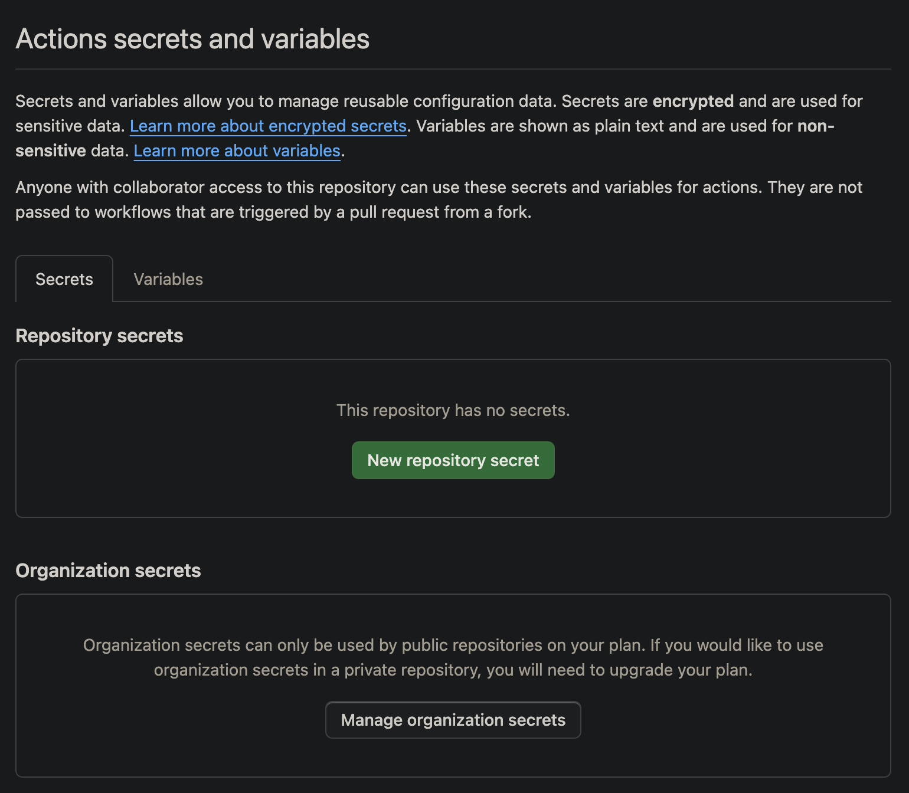
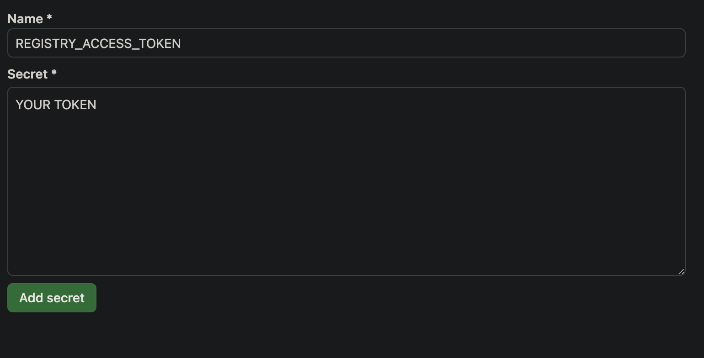

# node-publish-action

Uses [comfy-cli](https://github.com/Comfy-Org/comfy-cli) to publish the current version of your custom node to the [registry](https://comfyregistry.org). The goal is to create an easy way for developers to publish updates to their custom node to the registry.

## Getting Started

### Publish Node

Please finish the guide [here](http://localhost:3000/custom-nodes/overview#publishing-to-the-registry) for publishing to the registry befre continuing.

### Add Personal Access Token to Secrets

Add the personal access token you created on the registry website to your Github Secrets.

Go to Settings -> Secrets and Variables -> Actions -> New repository secret.

Create a secret called `REGISTRY_ACCESS_TOKEN`.





### Publish when pyproject.toml changes

The easiest way to publish custom node versions is to create this Github Actions workflow that runs everytime `pyproject.toml` changes. When you want to publish a new version, simply go and update the version field to the next version and commit it to main.

```yaml
name: "Publish to Comfy registry"
on:
  push:
    branches:
      - main
    paths:
      - "pyproject.toml"

jobs:
  publish-node:
    name: Publish Custom Node to registry
    runs-on: ubuntu-latest
    steps:
      - name: Check out code
        uses: actions/checkout@v2
      - name: Publish Custom Node
        uses: comfy-org/node-publish-action@main # TODO replace when published.
        with:
          personal_access_token: ${{ secrets.REGISTRY_ACCESS_TOKEN }} ## Add your own personal access token to your Github secrets and reference it here.
```

### Version Numbers

`comfy-cli` will publish the version written in `pyproject.toml`.

Make sure you update this before running the Github Action.

```toml

[project]
version = "1.0.1"
```
